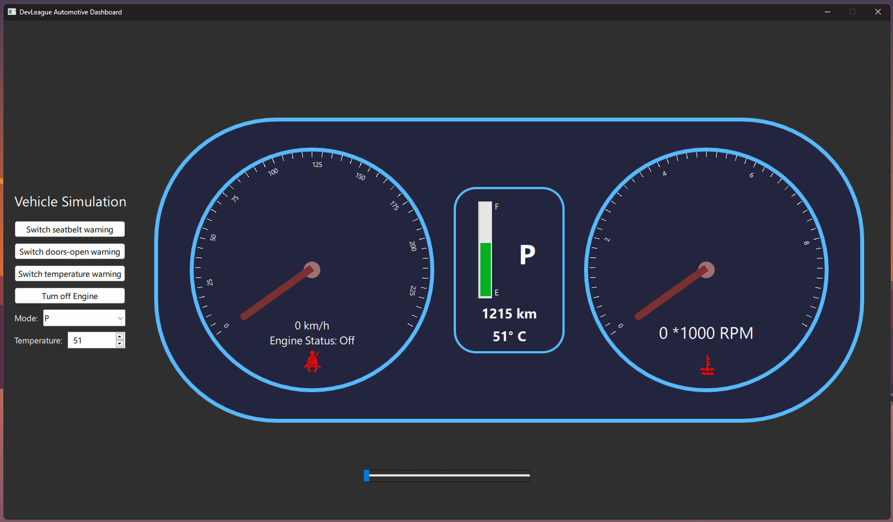

# Automotive Dashboard using QML and C++

## Description
- This project simulates a vehicle dashboard
- You can change the vehicle speed and watch it reflects on the speedometer & motor RPM.
- When the speed goes up to 130 km/h, the needles turn into Red color.
- You can enable/disable some warnings (i.e. seat-belt warning).
- You can turn off the engine and watch the speed needle goes back to zero.
- You can set the vehicle mode [P, D, R and N].
- Temperature & fuel level are constant (they can be easily changed using QML or C++).

## Communication between QtQuick (QML) & C++
- QtQuick (QML) represents the UI (front-end) of the application.
- Qt C++ represents the backend (application logic implementation) of the application. 
- for QML to send data to the backend (C++), Q_INVOKABLE macro is used so that QML can call/invoke a C++ function.
- for C++ to send data to the UI (QML), I used signals & slots where the backend emits a signal, and the slot/implementation is in .qml files.

## UI Screenshots

## Tools & languages used
- QML & C++
- Qt Creator
- Qt Design Studio